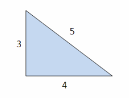

# Tutorial 4

## A. Code Review

Your tutor will split you up into your project groups, and provide you with a document to share your thoughts on:

* [review_1.py](https://gist.github.com/angary/42ff406252197406c5a4dd3f39015c6f#file-tut04_review_1-py)
* [review_2.py](https://gist.github.com/angary/42ff406252197406c5a4dd3f39015c6f#file-tut04_review_2-py)

Compare these two pieces of code from a pythonic, style, and readability point of view and choose which one you prefer. When you choose one, you must justify your reasoning in the shared document your tutor gives you.

[Link to document](https://docs.google.com/document/d/1Ura_jg7t4rvyePE0UMVpyWqoSahaLFtTSCbcybcrPD0/edit?usp=sharing)

## B. Software Verification

### Part 1 - Resolving a Defect

Given the Zune bug example from the lecture (in [day_to_year.py](day_to_year.py)) and a test that **doesn't** find the bug/defect (in [day_to_year_test.py](day_to_year_test.py)):
* Write a failing unit test that catches the bug;
* Trace through `day_to_year()` to find the problem; and
* Fix the bug.

### Part 2 - Coverage Checking

To check whether you have in fact removed the bug and that your tests are adequate, use [Coverage.Py](https://coverage.readthedocs.io) to measure and inspect your code coverage. You may need to add more to the test to have satisfactory coverage. Make sure you're doing **branch** coverage checking!

### Part 3 - Pylint

Run your [day_to_year.py](day_to_year.py) through pylint. Consider what issues it highlights and discuss, as a class, the alternatives for resolving them.

* Fixing the code so the issue no longer exists.
* Adding a pragma to the line the issue occurs, so pylint stops reporting it.
* Suppressing all instances of such errors via a config file.

You may wish to consult the [COMP1531 Style Guide] (https://google.github.io/styleguide/pyguide.html)

*Ensure pylint is run on your code.*

## C. The Object Model

Using the [my_math_library.py](my_math_library.py) we have provided you, write code to answer the following questions about this maths problem in [triangles.py](triangles.py).

We have the following triangle.



* How many sides does the triangle have?
* What is the area of the triangle?
* What is the perimeter of the triangle?
* Find the angle between the side of length `5` and `3`.

As you write the solution, discuss:
* What is the difference between a module, a class, and a function?
* What is the difference between 'normal' function and a method of an object?
* What is the difference between a 'normal' variable and an attribute of an object?

## D. Project Management with Jira

Your tutor will show you how to:
* Create a new workspace in Jira
* Create a new project (Kanban)
* Create a task on the board
* Create a subtask
* Assign someone to a task
* Move a task around the board

If you would like, you can use Jira to manage your team's project for the rest of the term (optional).

## E. More Python Practice

Write a program [prettydate.py](prettydate.py) that converts 24 hour time into 12 hour time.
- You may assume that all inputs will be a valid 24 hour time.
- You program should read each line of input from standard input until EOF and output the result to standard output.

Sample input:
```python
1234
0525
0000
0001
1904
```

Sample output:
```python
12:34 PM
05:25 AM
00:00 AM
00:01 AM
07:04 PM
```

*Ensure pylint is run on your code.*

Make your code as pythonic as possible.
