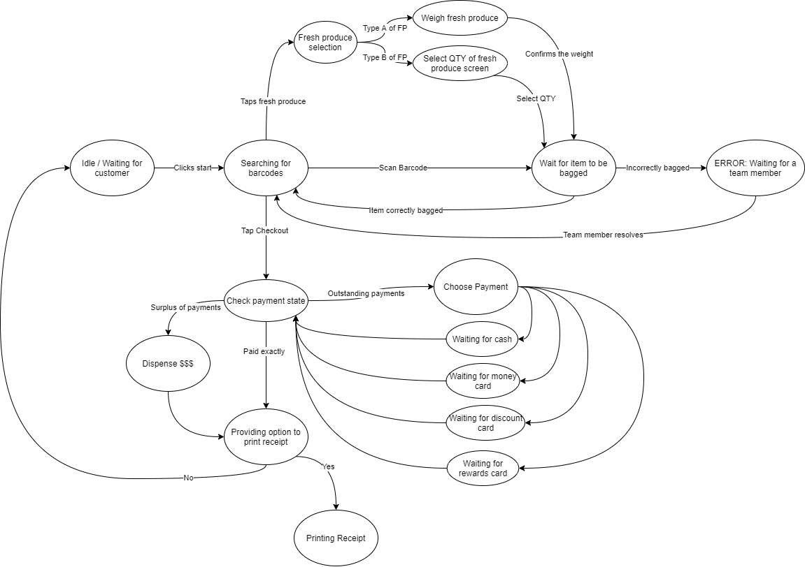
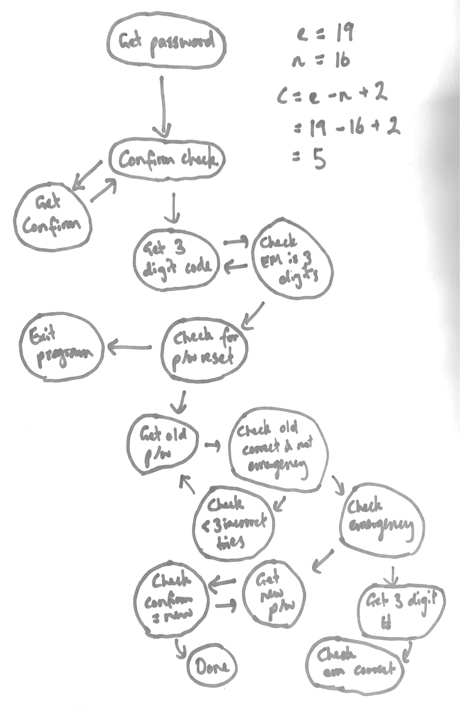

# Tutorial 9

## A. System Modelling

This exercise links to **[Lab 09 - State](state.md)**.

As a class, complete the first action and transition to get started. Then break into groups and complete the rest of the diagram.

> Useful websites:
> * https://app.diagrams.net/ (aka draw.io - is free)
> * https://lucid.app/ (has better features, but have to pay unless you sign up using UNSW account)

<details>
<summary>Solution</summary>



</details>

## B. Type Hints

Consider the `names_ages` code from Tute 05 where we made a simple flask server.

Add type hints to each function in `names_ages.py`. In an `if __name__ == '__main__'` block, call the function with a few values and use `mypy` to type-check the validity of the function calls.

## C. Cyclomatic Complexity

Using a graph, calculate the Cyclomatic Complexity of the following code:

```python
print('Welcome a password generator software.')

password = input('Password: ')
confirm = input('Confirm Password: ')

while confirm != password:
    print('Error! Passwords do not match.')
    confirm = input('Confirm Password: ')

print('Thankyou. Your password has been saved')

em = int(input('Please set an emergency 3-digit number: '))
while em < 100 or em > 999:
    print('Error. Your code was not a 3-digit number.')
    em = int(input('Please set an emergency 3-digit number: '))
print('Thankyou. Your emergency code has been saved.')

new = input('Would you like to reset your password? ')
counter = 0
emergency = False
if new == 'yes':
    old = input('Old password: ')

    while old != password and not emergency:
        print('Incorrect. Try Again.')
        counter += 1
        if counter == 3:
            emergency = True

        old = input('Old password: ')

    if emergency:
        em1 = int(input('Enter your 3-digit emergency number. '))
        if em1 != em:
            print('Incorrect. Your password cannot be reset.')

    else:
        new = input('New password: ')
        confirm = input('Confirm Password: ')

        while confirm != new:
            print('Error! Passwords do not match.')
            confirm = input('Confirm Password: ')

        print('Thankyou. Your New password has been saved.')

else:
    print('Exiting Program...')
```

<details>
<summary>Solution</summary>



</details>

## D. Exam-Style Problem

Write a program in [acronym.py](acronym.py) that asks the user for a multi-word name and then passes it to a function `acro` that returns the corresponding acronym, which is then printed to the user.

Example usage:
```txt
What is the name? World Health Organisation
It's acronym is WHO.
```

## E. A Simple Class

In `point.py`, complete the class definition according to the provided documentation.

As you complete the exercise, discuss as a class:

* Revision: what is a class versus an object?
> A class is like a template for an object, and an object is an instance of a class

* What is the `__init__` method?
> `__init__` is a constructor, which is a method that intialises the object's variables
* What is `self`?
> Self is the current instance of the object / a reference to the current object
* How are the `__add__` and `__mul__` methods different from normal methods, and how can we use them?
> Magic methods - can be called canonically (i.e. `p3 = p1.__add__(p2)`) or by using their operators (operator overloading) (i.e. `p3 = p1 + p2`)
