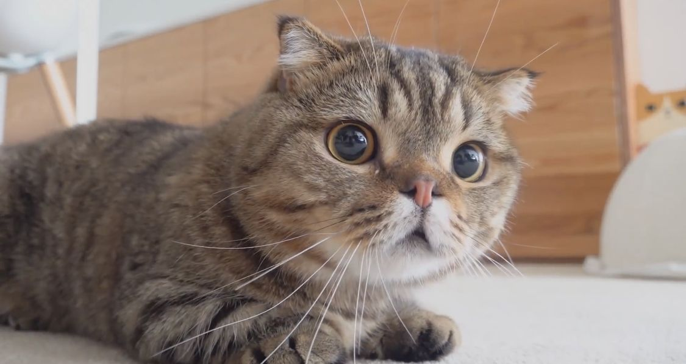

# Tutorial 10

[TOC]

## A. MyExperience

> 10 minutes

It's time to fill out MyExperience! 

Your tutor will give you 10 minutes to fill out the MyExperience survey which you can access on UNSW Moodle.

Please do so (even if it is just ticking the boxes) as the information is invaluable to us, and also because the cat below will be eternally unhappy otherwise!




## B. History

1. Create a new branch from this repository called `history`.
    
1. Create a new file called `lost.txt` and commit it to history.

1. Look at the last 3 commits in the log.

1. Hard reset to the second most recent commit (before the one we've just done). What does this do?

1. Create a new file called `retain.txt` and commit it to history
    
1. This time, soft reset to the second most recent commit. What does this do?

## C. Complexity Analysis

Below are solutions to `lab01_leap`. For each function, draw a control flow graph and calculate the resulting cyclomatic complexity.

1. `isLeap`:
    ```ts
    const isLeap = (year: number) => {
      let result: boolean;
      if (year % 4 !== 0) {
        result = false;
      } else if (year % 100 !== 0) {
        result = true;
      } else if (year % 400 !== 0) {
        result = false;
      } else {
        result = true;
      }
      return result;
    };
    ```

1. `getNextLeap`:
    ```ts
    const getNextLeap = (year: number) => {
      let nextLeap = year + 1;
      while (!isLeap(nextLeap)) {
        nextLeap++;
      }
      return nextLeap;
    };
    ```

1. `countLeaps`:
    ```ts
    const countLeaps = (yearArray: number[]) => {
      let count = 0;
      for (const year of yearArray) {
        if (isLeap(year)) {
          count++;
        }
      }
      return count;
    };
    ```

You may want to retain your notes for the incoming Kahoot, which will contain a more challenging example.

## D. Kahoot Activity

You will spend the remaining part of the tutorial doing a Kahoot activity with your tutor. They will share a code with you!
